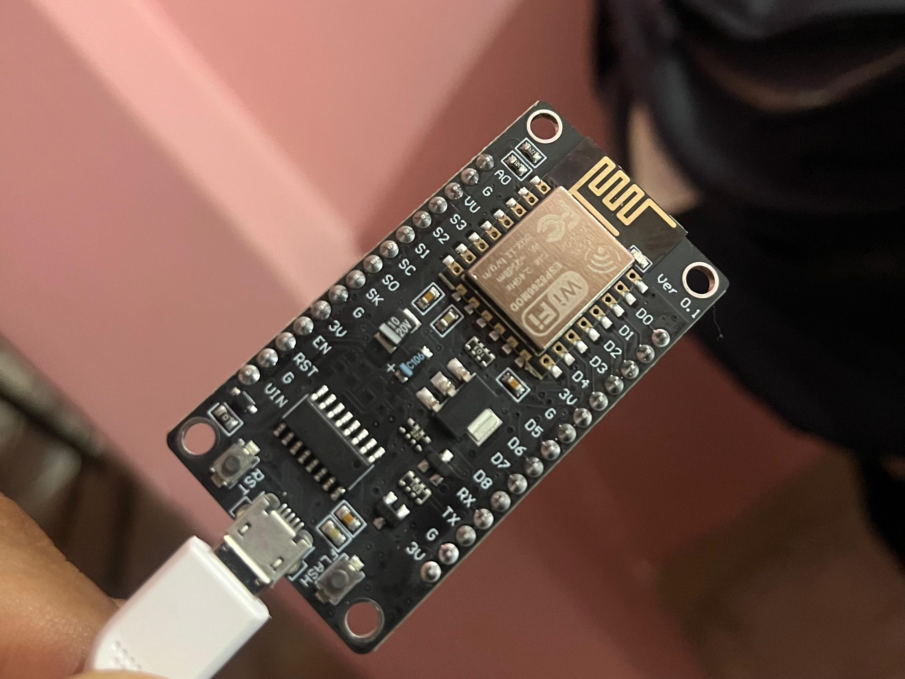
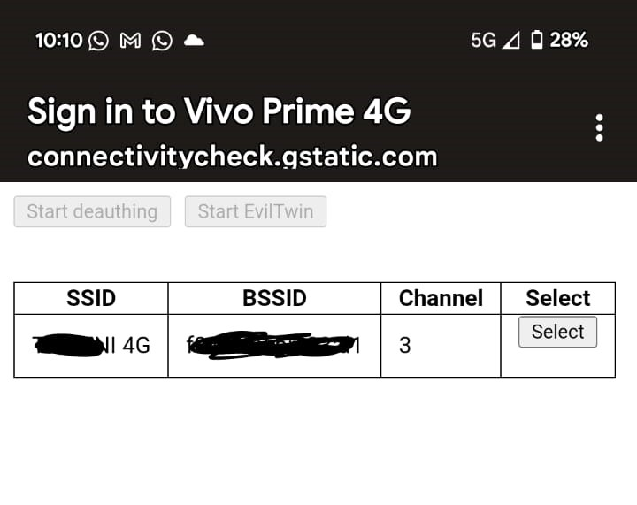

# IoT-WiFi-Attack-Tools-ESP8266-Deauther
"A project leveraging ESP8266 for WiFi Deauth and Evil Twin attacks."

# Building WiFi Attack Tools: A Beginner’s Guide

**Author:** Vola12do  
**Date Published:** 22-01-2024   

---

## Overview

This guide introduces beginners to WiFi hacking using a low-cost, versatile device called the **ESP8266 NodeMCU**. While traditional tools like Aircrack-ng are effective, they often feel outdated in the face of modern WiFi security. The NodeMCU, paired with custom firmware, provides a practical and accessible alternative for exploring WiFi attacks like **Deauthentication (Deauth)** and **Evil Twin Attacks**.

This project is intended for educational purposes only, demonstrating the foundational logic behind these techniques while emphasizing the importance of ethical and responsible use.

---

## Hardware Requirements

To get started, you’ll need:
- **NodeMCU or ESP8266**: A microcontroller that supports WiFi hacking, costing around ₹150 (~$2).

- **USB to Micro-USB Data Transfer Cable**: Ensure it supports data transfer, not just charging.
- **Laptop or PC**: To set up and flash the firmware.

---

## Software Requirements

- **Arduino IDE**: Essential for programming the NodeMCU.
- **PhiSiFi Repository**: Provides the required firmware and codebase.

---

## WiFi Hacking Techniques

### 1. **Deauthentication (Deauth) Attack**
Think of this as sending "disconnect" messages to devices on a WiFi network. The attack floods the network with signals, forcing devices to disconnect. It's effective for testing network resilience but should only be used for ethical purposes.

### 2. **Evil Twin Attack**
Create a fake WiFi network resembling a legitimate one. When victims connect to the fake network, their credentials (e.g., passwords) can be captured. This technique highlights the risks of connecting to untrusted networks.

---

## Getting Started: Setting Up the NodeMCU

### Step 1: Install Arduino IDE
1. Download the **Arduino IDE** from the [official website](https://www.arduino.cc/en/software).
2. Install it on your system.

### Step 2: Configure Arduino for NodeMCU
1. Open Arduino IDE and navigate to:
   - `File` -> `Preferences`.
2. Add the following URL in the **Additional Boards Manager URLs** field:https://raw.githubusercontent.com/SpacehuhnTech/arduino/main/package_spacehuhn_index.json

### Step 3: Install the Deauther Package
1. Go to:
- `Tools` -> `Board` -> `Boards Manager`.
2. Search for `Deauther Package` and install it.
   

### Step 4: Select the ESP8266 Deauther Board
1. In Arduino IDE, go to:
- `Tools` -> `Board`.
2. Select **ESP8266 Deauther**.

### Step 5: Connect Your NodeMCU
1. Use a USB-to-Micro-USB data cable to connect your NodeMCU to the PC.
2. Ensure the cable supports data transfer.

### Step 6: Find the COM Port
1. Navigate to:
- `Tools` -> `Port`.
2. Select the correct COM port (e.g., `COM3` or `COM4`).

### Step 7: Flash the Firmware
1. Clone the **PhiSiFi** GitHub repository:

2. Open the `.ino` file in Arduino IDE.
3. Click **Upload** to flash the firmware onto the NodeMCU.

---

## Using the NodeMCU for WiFi Attacks

1. Power on the NodeMCU and connect to the access point (AP) named:
- **SSID:** `Vivo Prime 4G`
- **Password:** `d347h320`
 .png)
2. From your browser, visit `192.168.4.1/admin`.
3. Select the target AP you want to attack:
- Refresh the list every 30 seconds.
4. Choose an attack:
- **Deauth Attack:** Disconnect devices from the target network.
- **Evil Twin Attack:** Create a fake AP with the same SSID as the target.
5. Stop the attack by resetting the NodeMCU or visiting the admin panel.
.png)

---

## Features

- **Customizable AP Name:** Modify the SSID for the fake network.
- **Portability:** Run the device on any power source (laptop, power bank, charger).
  
- **Compatibility:** Supports only 2.4 Ghz, I am making One for 5Ghz using "BW16"

---

## Limitations

- **Data Loss:** Credentials and logs are lost if the device is powered down or reset.
- **Ethical Use:** This tool is strictly for educational purposes and ethical security assessments.

---

## Why NodeMCU?

- **Cost-Effective:** ₹150 (~$2) for a powerful microcontroller.
- **Ease of Use:** Minimal setup and intuitive operation.
- **Portability:** Operates independently once configured.

---

## Disclaimer

This guide is for **educational purposes only**. Unauthorized use of these techniques may violate laws and ethical guidelines. Always ensure you have permission before conducting security assessments.

---

## Credits

- **PhiSiFi** GitHub Repository: [PhiSiFi Repo](https://github.com/spacehuhn/esp8266_deauther)
- Inspired by the cybersecurity community.

